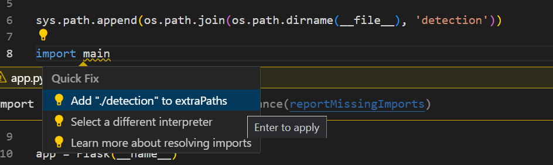

#License Plate Recognition Project
------------------
This is a license plate recognition project that involves training a model with a custom dataset to detect license plates in images. The trained model identifies the license plates, and with the help of OCR (Optical Character Recognition), it extracts the alphanumeric characters from the detected plates. The output includes the recognized text along with the confidence scores of both the OCR and the license plate recognition model.

Python version = 3.10.11 (venv)

Requirements: [detection\requirements.txt](https://github.com/rankum26/licenseplate-recognition-kumarran26/blob/main/detection/requirements.txt)

License Plate Recognition Training Repo: https://github.com/rankum26/licenseplate-recognition-training-kumarran26

#Problem and Motivation
------------------
Every year I drive to the Côte d’Azure by car and there's always traffic jams due to tolls in Italy and France. It would be better if you could just swipe the credit card at the beginning of the highway and have it automatically charge you based on where you exit. This would save time and be more efficient.

This is just one example of how barriers can cause delays and inefficiencies. We see them everywhere, from toll booths to parking garages. Each time we stop to pay a fee or wait for a gate to open, we lose time.

Imagine a world without barriers. With electronic toll collection systems, we could drive through without stopping. We could enter parking garages without taking a ticket.

This is not a dream of the future, it's a reality today. There are already a number of cities and countries that are using these technologies to make their transportation systems more efficient. For example, in the Archhöfe Winterthur parking garage, drivers can pre-register their license plate and payment method in the ParkingPay app, allowing them to enter the garage without taking a ticket. Upon entering, their license plate is recognized and their parking fee is automatically deducted upon exit.

I am passionate about this project because I believe it has the potential to make our lives easier and more efficient.

#Data Collection
------------------
To gather data, I used all available car pictures from my smartphone that clearly show license plates. Although the dataset is not big, it is challenging to find a publicly available dataset with license plates, especially from Switzerland. [Dataset](https://github.com/rankum26/licenseplate-recognition-training-kumarran26/tree/main/data_new/images/train) 

#Annotation
------------------
For the annotation process, I used [CVAT](https://www.cvat.ai/). I uploaded all 249 images to CVAT and manually annotated them, marking the license plates. The annotations were then exported in YOLOv1.1 format, resulting in a set of label files (.txt) corresponding to each image. These label files are crucial for training the model.

#Training
------------------
The training section of the project is excluded from this repository because it became too cluttered, lost its clarity and it's easy to copy-paste the trained model into the model folder here. You can find the training repository [here](https://github.com/rankum26/licenseplate-recognition-training-kumarran26). In that repository, I trained the model for 100 epochs, which took approximately 8.5 hours. Shorter training sessions did not yield usable results.

The training process generated valuable metrics such as confusion matrices, F1 curves, precision-recall curves, and detailed training and validation logs.

The best model from the training process is stored as best.pt in the runs/detect/trainXX folder, which you can find in the training repository. Copy this model and place it in this project's detection/model directory. This repository already includes the best.pt model for your convenience, but you can replace it with your own trained model if desired.

#Running the Application
------------------

Python version = 3.10.11 (venv)

install requirements.txt

you may have to do a quick fix on the app.py file choose 
add ./detection to extraPaths

To run the Flask application, use the following command:
python app.py

The application provides a frontend where you can upload an image. If you don't have images of cars with license plates, you can use the provided example images in the example_pictures folder. After uploading an image, click the green submit button. The model will attempt to recognize the license plate and extract the characters with OCR. OCR is used to extract the text from detected license plates in images. After the license plate is identified and its region is cropped from the image, the OCR engine (EasyOCR in this case) processes this cropped image to recognize and extract the alphanumeric characters on the license plate. I did not train the OCR model. I only trained the license plate recognition model. The extracted text is then displayed along with a confidence score, indicating the reliability of the OCR result.
The result page will show also the uploaded image, the recognized plate, and a grayscale thresholded version of the plate. You can repeat the process by clicking "Upload another image."

#Interpretation and Validation
------------------
Upon training the model for license plate recognition on my custom dataset, I proceeded to interpret and evaluate the performance of the model. The primary objective was to accurately detect and recognize license plates in images, followed by using OCR to extract the characters from the detected license plates with confidence scores. The license plate recognition model was trained and evaluated using two different settings: 50 epochs and 100 epochs.

Confusion Matrix: The confusion matrix for the 100 epochs model demonstrated superior performance, with 269 true positives and 19 false positives, compared to the 50 epochs model, which had 262 true positives and 32 false positives. This indicates that the 100 epochs model was more effective in correctly identifying license plates and minimizing false detections.

F1-Confidence Curve: The F1-Confidence Curve highlighted that the 100 epochs model achieved a higher peak F1 score of 0.97 at a confidence threshold of 0.512, compared to the 50 epochs model, which had a peak F1 score of 0.96 at a threshold of 0.536. This demonstrates the better balance between precision and recall achieved by the 100 epochs model.

Precision-Confidence Curve: The Precision-Confidence Curve for the 100 epochs model indicated that it reached perfect precision at a confidence threshold of 0.858, whereas the 50 epochs model achieved perfect precision at 0.812. This suggests that the 100 epochs model was better at maintaining high precision with fewer false positives at higher confidence levels.
Precision-Recall Curve: The Precision-Recall Curve showed that the 100 epochs model had a mean Average Precision (mAP) of 0.984, which is higher than the 50 epochs model’s mAP of 0.976. This metric further supports the improved performance of the 100 epochs model.

Recall-Confidence Curve: The Recall-Confidence Curve for the 100 epochs model maintained high recall up to a confidence threshold of 0.5 before declining, while the 50 epochs model exhibited a sharp decline in recall after 0.6, indicating that the 100 epochs model was more consistent in detecting true positives.

Annotated Images: Comparing the annotated images from both models, the 100 epochs model demonstrated higher accuracy and confidence in its detections. It correctly identified license plates with higher confidence scores, typically above 0.80, whereas the 50 epochs model occasionally misidentified non-license plate regions with lower confidence scores, such as 0.45.

Manual Review: Human validation was performed by comparing the model's predictions with ground truth annotations. The 100 epochs model showed a higher agreement with human annotations, confirming its superior performance. The 50 epochs model, on the other hand, sometimes misidentified regions, demonstrating the importance of extended training.

Validation with Confidence Scores
The confidence scores provided by the model were used to evaluate the certainty of predictions. Higher confidence scores in the 100 epochs model indicated more reliable detections. This validation step confirmed that the model trained for 100 epochs not only performed better in terms of metrics but also provided more trustworthy predictions.

#Help or Questions
------------------
If you need help don't hesitate to contact me over Teams: kumarran@students.zhaw.ch 
Otherwise you can [ask my bestfriend](https://chatgpt.com/) :D 